# Tower Defense Game

Note: Please star the repo if you find this project useful. 

## Introduction

The purpose of tower defense (TD) games is to protect a player's territory or holdings by impeding opposing attackers or preventing adversaries from accessing exits, which is commonly accomplished by erecting defensive structures on or along their course of assault. This usually entails erecting a variety of constructions that automatically block, obstruct, attack, or destroy foes. The genre's fundamental tactic is the strategic selection and placement of defensive pieces. In this project, we have 2 towers, one belonging to the enemy(from which they spawn) and the other is the fortress that we have to protect. In order to do this, the user is offered a variety of weapons in his arsenal to place along the path taken by the intruders. The weapons, to name a few, include a cannon and a mortar. The cannon locks onto a particular enemy and shoots till either the enemy is dead or the enemy moves out of its range. The mortar, on the other hand, delivers splash damage to enemies within its range.

At each level of the game, the player is given a certain no. of lives and coins to erect his defenses. Also, through the game map, weapons can only be placed at certain locations. This further requires the player to think strategically and place his defenses with utmost precision. As the level increases, the difficulty increases progressively, in the sense that the enemy waves increase along with the no.of enemies in the wave. The enemies too differ in their respective health points. A total of 7 types of enemies have been included in this game. The game design and the UI components have been further discussed in this document.

The engine used to develop the game is Unity, and the scripting has been done in C#. Certain game objects have also been designed and developed using Blender.

## Game Design

### Path

The path to be followed by the enemies has been implemented using the Bezier Curve. A Bezier curve is a parametric curve used in computer graphics and related fields. A set of discrete <b>"control points"</b> defines a smooth, continuous curve by means of a formula. We give the bezier a certain number of path points and it constructs the curve accordingly, based on the number of points given. The BSpline.cs script gives a detailed description of how the curve is constructed through these points. The constraint is that there must be at least 2 path points for the curve to be rendered properly.

Following are some <b> parameterized equations a Bezier path offers </b>:

Given the coordinates of control points Pi: the first control point has coordinates P1 = (x1, y1), the second: P2 = (x2, y2), and so on, the curve coordinates are described by the equation that depends on the parameter t from the segment [0,1].

The formula <b> for a 2-points curve </b>:

<code> P = (1 - t)*P1 + t*P2 </code>

<b> For 3 control points: </b>

<code> P = (1 − t)*2*P1 + 2*(1 − t)*t*P2 + t*2*P3 </code>

<b> For 4 control points: </b>

<code> P = (1 − t)*3*P1 + 3*(1 − t)*2*t*P2 + 3*(1 − t)*t*2*P3 + t*3*P4 </code>

### Cannon

In the task of weapon placement, the user is given an option to place the weapon across the terrain given at each specific level, based on the amount of money and resources you have. The design of the cannon is, to some extent, simple and straightforward. The cannon designed in the game locks a “single” target at a time. It shall only fire when an enemy is within its range. Each cannonball fired by the cannon has a certain hit point associated with it. Once the cannon kills an enemy, it has to find the closest target in its vicinity i.e an enemy within its range. Since the game gives an option to upgrade the cannon, cannons may vary in their respective properties. Once a cannon locks an enemy, its nozzle should rotate with the movement of the enemy and should try to match the enemy’s pace. The user has the option to increase the fire rate however, it will consume the ammo faster and eventually when the cannon runs out of ammo, it will stop firing even if an enemy is within its range. To detect an enemy in range it will have a sphere collider. A cannonball will also have its own stats which mainly is its hitpoint. Ensure that each cannon has a tag so that it can distinguish between an enemy and a friendly cannon.

The use of the game part is primarily to kill the incoming enemy waves. The user can add the cannon to his arsenal and place it on the terrain or sell it by buying some other weapon. m_target is an empty game object with the EnemyAI script assigned to it.

For the script CannonAI, in the SerializeField we take the cannon’s range, its nozzle(needed for rotation), the cannon’s stats(cannonStats) which is a Scriptable Object(SO) and lastly the cannonball fired from the cannon which is also an empty gameobject. In the “Start()” method we assign the radius of the Sphere collider which will be triggered by the enemy object. The cannonFire() function is a Coroutine that is responsible for choosing a target enemy and Fire till its health is zero. It instantiates a cannonball after the fire delay(in the cannonStats). We then take away the health of the enemy using the EnemyAI’s reduceHealth() function which takes in the m_damage attribute in the cannon stat’s SO. In the Update() part, the cannon finds a target and accordingly starts firing if it has an enemy in its vicinity. The cannon will stop fire when m_fireCo = null. If the enemy goes out of range but was not killed and the cannon was firing, the coroutine for firing is stopped. If the cannon has a target, the cannon’s nozzle has to be rotated in the direction of the target. The direction is calculated by subtracting the position of the enemy and that of the cannon’s nozzle. The angle is calculated by taking the tan inverse of the direction’s x and z component(as these vectors lie in the cannon-enemy plane). The cannon is rotated using Quaternion.AngleAxis() function which takes the angle and the direction about which we have to rotate the cannon. The nozzle’s rotation is changed using the quaternion.Slerp() function which takes in the rotation and its angular velocity in cannon Stats SO.

In the CannonRange script, the OnTriggerEnter() will take a collider as a parameter and it is its job to register the enemies that “enter” the collider in an Hashset of gameobject called m_potTargets. In this function if the tag of the game object that collided with the collider is “Enemy” it will add a function “onEnemyDeath()” to the deathEvent to which it will execute when the enemy dies. The enemy is then added to the hash set of m_potTargets. The OnTriggerExit() will take a collider object as a parameter and it is its job to remove the enemies from the HastSet if they exit the collider’s radius. If the tag of the gameObject is “Enemy” it will remove from the deathEvent the onEnemyDeath() function added to it when it enters the region. In the Awake() we instantiate the hashset of gameObjects. This function is executed to initialize variables or states before the application starts. The isTargetInRange() is used to check if the gameObject is still in range. A gameobject is in range if it is still present in the hashSet. OnEnemyDeath() is executed when the enemy dies and it removes the enemy from the hashSet when it dies.

The getNextTarget() checks if there are potential targets by checking if there are any objects in the hashSet using the “Count” and returns the enemy distance from the cannon. It then finds the target with the shortest distance (gb.transform.position is position of the enemy and transform.position is the position of the cannon). It uses a linear search. If the target is not in range, we call the method again(Recursive call till no potential enemies are left). In the CannonBall script, the cannonBallStats is a scriptable object with the properties of the cannonBall. The cannonBallMovement() is a coroutine that takes the enemies position(destPos= m_target.transform.position) and the cannonball’s position and makes the cannonBall move towards the enemy while it is in the radius of the cannon. We then destroy it after 0.2s(once it hits the enemy it disappears). The moveCannonBall function adds the destroyBall function to the enemy's deathEvent, so that it gets destroyed with the enemy. Once the cannonBall is destroyed we remove the “destroyBall()” function from the enemy’s deathEvent(Action).

### Mortar

The designed part belongs to the part where the player has to place the weapon, the working of the weapon is being made. The mortar is being made, so it would contain many things such as how the mortar is detecting the movement of the enemies, the shooting of the mortar ball in a parabolic path and then reducing the health of the enemies when the mortar ball hits them. So, basically we are making the AI of the mortar so that it would know whom to attack, how much damage to deal and how much will be the fire rate of the mortar.

The design of the mortar will be done on Unity using the different models present there such as Cylindrical GameObject, Spherical GameObject etc. We have to make the mortar ball also which will be made using a spherical GameObject. In the hierarchy we are going to stack them in an empty GameObject so that we make a Prefab out of it and after making the prefab we are going to store it in the Assets folder. If we put it in the Assets Folder we can use it anytime later if wanted. We are also going to put scripts there so that it can dictate the behavior of the mortar. We also need a script that will dictate the path of the mortar ball. We have to program the mortar such that it follows the enemy when it is in range of the mortar. We are going to achieve this using a collider and the collider will detect the enemy movement and then put the enemy information on the list so that the mortar would know which enemy to go after in order to shoot the mortar ball in that direction. So the scripts have to be designed such that the fire rate of the mortar is also in control. When the mortar ball hits the enemies it gets destroyed and then the enemies health is reduced. We also need to add the feature of doing splash damage from the mortar ball. This means that if two enemies are nearby . This is a very effective method of making the mortar because it gets easier to know which enemies to kill in order.

The developed game part will be used in the game when the player will place the weapons on the side of the path. The mortar is being made, which is one of the weapons that can be placed on the sides in order to kill the enemies going from the path. So basically it is one of the most important part of the game because it is a weapon which will be used for killing the enemies and used by the player to place it around the path. 

The job of the MortarAI.cs script is to control the actions of the Mortar about whom to target, how to target and many other things.

At the top a GameObject m_target is declared which will contain the target it has to shoot, then the variable m_fireCo will tell about the fire pattern of the mortar, when to fire and when not to fire. There are many classes taken such as Transform m_mortarNozzle, MortarRange which is a different script on a game object which sees the range of the mortar. The mortarSO is also there which contains the information about the mortar such as the fire rate, the damage it needs to deal and the speed with which it needs to rotate around when the mortar finds a new enemy. In the Start() method we are setting the radius of the m_mortarRange because it will tell what should be the range of the mortar in which it needs to find the enemies and then shoot at them. In the Coroutine mortarFire() we are getting the EnemyAI script which is on the enemy in range of the mortar. There we have a while loop which tells the mortar to generate a mortar ball and then fire it at the enemy in range. Here the fire delay is used which dictates the fire rate of the mortar.

In the Update() function first we are checking if there is an enemy in range or not using the m_mortarRange variable that we have declared above. If an enemy is in range then we start firing the mortar ball at the enemy. If the enemy dies and there is no more enemy in range then we would stop the fire and put the m_target as null. If another enemy gets in range then we start the m_fireCo coroutine again.

For rotating the mortar in the direction of the enemy, for that we have used the mathematical formulae and the function available in Unity. Basically we have to rotate the nozzle of the mortar and we have taken it initially in the variable m_mortar.

The Parabola Controller Script is used for making the curve of the parabola using 3 points i.e. the starting point, the topmost point, and the ending point. We have made a function called FollowParabola() that tells a GameObject how it needs to follow the given parabola made by this script. If we have the points then we can also calculate different important details such as flight time, range and other things. Many Unity in-built functions were used for applying the math formulae. There are two classes, one is Parabola 3D and the other one is Parabola 2D. The concept of making a 2D parabola is used in making the 3D parabola. We are refreshing the curve at every point which gives us the values of all the points on the parabola and then we can tell the mortar ball what parabolic path to follow.

The Mortar Ball Range script will be used to detect the enemies that are near the mortar. So, basically a Sphere Collider is on this game object. We have a Hash Set variable called m_potTargets which will have a list of potential targets that can be targeted by the mortar.

We have an in-built function called OnTriggerEnter() from Unity which gets called when there is a game object that collides with the sphere collider. So in this function we are checking if an enemy has entered the collider or not if an enemy has come in the range then we will add the enemy in the potential targets for the mortar. We also have a death event that gets triggered when the enemy dies. The event is used to tell other functions that the enemy has died so there is no need to interact with that game object now.

There is also a OnTriggerExit() function which get called when any game object leaves the collider area. Inside this function we are checking if the game object that is leaving the collider area is an enemy or not. If an enemy is leaving the collider area then we remove it from the potential target set of the mortar.

The in-built Awake() function gets called when the instance of this script is made on a game object. So in this function we are just initializing the Hash Set that is going to store the list of potential targets.

We have made a function called isTargetInRange() which tells if the given game object given in the function as argument is present in the HashSet or not. The function onEnemyDeath() is called when the enemy gets destroyed by the mortar then the enemy is removed from the potential targets list as the enemy has been destroyed. The function getPotTargets() is used to get the whole Hash Set that contains the information about the potential targets for the mortar.

This MortarBall script is used to control the behavior of the mortar ball that will be generated by the mortar to kill the enemies. We have many different variables such as MortarBallSO that contains all the information about the mortar ball such as the damage radius of the ball and how it will do the splash damage. Then we have the MortarBallRange which tells us the range of the ball till where we can throw the mortar ball. Then we have three game objects i.e. pathStart which will contain the point which would be the starting of the mortar ball, pathTop which will contain the maximum height of the mortar ball and the last is pathEnd which will contain the point where the mortar ball needs to be.

Then we have the Hash Set of the potential targets that the mortar ball can deal damage to. The m_mortarDamage variable contains the number that would be needed to be reduced from the enemies. If the enemy is moving which would be the normal case then we would need a fixed last point of the enemy because the mortar ball is not a heat seeking missile that would follow the enemy and then reduce the damage. We would also need information such as distance of the enemy and the direction of the enemy so we have the distanceEnemy and directionEnemy variable.

In the Start() function we are first setting the radius of the m_mprtarBallRange and the pathStart will be the nozzle of the mortar so we are setting that here. We are also getting the ParabolaController script so that we can set the speed of the mortar.

The coroutine mortarBallMovement() will be used to move the ball along the parabola. Here we are first finding out the distance between the mortar and the enemy and then we are finding the direction in which the enemy is. After that we set the pathTop and the pathEnd. After that we tell the mortar ball to follow the parabola until it reaches near the enemy. Once it reaches near the enemy it can stop following the parabola and whatever enemies are near the mortar ball will deal with damage. For this we are first checking which enemies are near the mortar ball and then we reduce their damage accordingly. And then after that we destroy the mortar ball.

Then after that we have the last function called moveMortarBall() which takes in the target and the damage of the mortar. This function will be called from MortarAI.cs script. This function contains the last position of the enemy and then starts the coroutine mortarBallMovement().

### Game UI

The game UI has been developed using Unity In-built UI components. There are a total of five distinct scenes throughout the game. They include: Main Menu, Level Select, Game levels(10 levels), Level Completed and Game Over scene. One common feature of all these scenes is that the basic components behind all these scenes are the Canvas and Panel UI components in Unity.

The MainMenu scene has a turret that rotates constantly. Its rotation speed and angle is controlled by a C# script. On its body and nozzle the user is offered the Play and the Quit game button which are nothing but TextMeshPro Buttons.On clicking the Quit button, the user exits the game. On clicking the Play button the user is directed towards the Level Select Screen.

The Level Select game is a grid Layout of buttons. It also has a scroll rect component attached to it which allows scrolling, if at all more levels are added to the game. The content size controller prevents overflow. We have a total of 10 levels in the game, consequently, there are 10 TextMeshPro buttons corresponding to each level. Each button leads to a particular level. The buttons have been given a clicking animation, so that the user clearly interpretes th button clicking action. Once a button is clicked, a level is loaded.

For the main game environment we have imported the asset “Forest - Low Poly Toon Battle Arena / Tower Defense Pack”, from the unity asset store, It offers a number of components using which one can build the level map according to their liking. We designed the entire 10 game levels in a bottom up fashion and after each iteration we ended up with a complete level. Each level shows the number of lives the player has to complete the level and coins using which he places his defenses. If an enemy dies, a coin is spawned and added to the total coins of the player. The player can start the next Wave using the “Start Next Wave” button, once he has erected his defenses.

If the player completes the level, the level completed scene is shown. This scene has 2 TextMeshPro buttons, “Next Level” and “Main Menu”. The former directs the player to the succeeding level whereas the latter redirects him to the main menu screen.

If however, the player fails to clear the level, the Game Over scene is shown. The player is offered 2 options, to either retry or go back to the main level. This again utilizes 2 TextMeshPro buttons.

### Animation

The enemy character also has the animator applied on it which tells it to walk when instantiated. The animation controller was made using the character’s walking animation available on Mixamo. The character starts walking after entering the scene. This was done using the “Animator” component available in Unity.

An Animator Controller allows you to arrange and maintain a set of Animation Clips and associated Animation Transitions for a character or object. In most cases it is normal to have multiple animations and switch between them when certain game conditions occur. For example, you could switch from a walk Animation Clip to a jump Animation Clip whenever the spacebar is pressed. However even if you only have a single Animation Clip you still need to place it into an Animator Controller to use it on a GameObject.

The Animator Controller has references to the Animation clips used within it, and manages the various Animation Clips and the Transitions between them using a State Machine , which could be thought of as a flow-chart of Animation Clips and Transitions, or a simple program written in a visual programming language within Unity.

The in-built Slerp function was used to rotate the nozzles of Cannon as well as Mortars. The Slerp function gives a sense of animation while rotating something because it rotates with each time frame.

### Level Generation

One of the most important components in this game is the placement of the weapons in the level mesh plane. This task required incorporating concepts like Raycast and Collision Detection for successful implementation. Casts a ray, from point origin, in direction direction, of length maxDistance, against all colliders in the Scene. You may optionally provide a LayerMask, to filter out any Colliders you aren't interested in generating collisions with. Specifying queryTriggerInteraction allows you to control whether or not Trigger colliders generate a hit, or whether to use the global Physics.queriesHitTriggers setting.

We have created a layer called the “placementplane” . The grids on which this layer is attached allow for the placement of defenses.

In simple terms, we have created a bounding box(aabb) which basically covers the entire base of the cannon/mortar. From the 4 bottom edges of the bounding box, rays are cast and if all of them collide with the placement plane, the weapon is highlighted as green indicating that the weapon can be placed at that particular place else it is highlighted in red consequently, the player is not allowed to place the weapon.

To further enhance the experience, when a player select a weapon from the HUD, a “pseudo model” of the selected weapon is created so that the player is guided as to how the weapon’s orientation will be on placement.

### Enemy

There are seven different types of enemies in the game. The enemies such as Lumberjack1, Lumberjack2, Lumberjack are the weak enemies while enemies such as Skeleton, Dahaka, Parasite and Warrok are strong enemies. The last four enemies were taken from Mixamo. The enemies have different health and different speed. The Lumberjacks have the health as 100 while the Lumberjack1 and Lumberjack2 have speed as 2, the Lumberjack3 has speed as 3. The high class enemies such as Skeleton and Dahaka have health as 160 and speed is 4 while Parasite and Warrok has health as 170 and speed as 4. Each of the enemy model characters has “Rigidbody” attached to it so that it can have mass and can be collided with other game objects.

They also have a Mesh Collider and Capsule Collider attached to them so that the other game objects that have rigid body attached to them can sense the collision of the enemies. Then we have the EnemyAI script whose job is to control the health of the enemy and the Destroy event as well. The EnemyMovement script on the enemy characters is responsible for the movement of the enemies from one point to another point in the game. There are a set path that the enemies has to follow and the path is generated using the Bezier Path. The Enemy Movement Script gets the information about the path points using the game object “Spawn Point”. When the enemy spawns the path that the enemy has to follow is passed from the Spawn Point game object to the enemies. The enemy movement also has the features such that the enemy turns the way it has to go and then only it starts moving that way. The enemy character also has the animator applied on it which tells it to walk when instantiated. The animation controller was made using the character’s walking animation available on Mixamo. The character starts walking after entering the scene. This was done using the “Animator” component available in Unity. All the enemies have the “Enemy” tag implemented on them.

### Sound Effects

The sound effects were incorporated in the game using the “AudioSource” component that is already available in Unity. As we know there are many scenes in the game. The scenes are MainMenu, LevelSelect, NextLevel, GameOver and the 10 levels of the game. The MainMenu has a game object called the Audio Component which has the AudioSource unity component attached to it. The background music is added to this AudioSource and the play on awake checkbox is checked so that whenever the scene opens it starts playing. The loop checkbox is also checked so that when the music ends it gets started again. The Level Select has the same background music as the MainMenu but here the AudioSource component is placed on the Canvas, this has little to no effect on the performance, we are just saving making another game object for this specific purpose. After the player opens one of the levels by selecting the level from the canvas, the level opens. Each of the levels has the same background music which is different from the MainMenu and the LevelSelect. If the player wins the level then they are sent to the LevelComplete Scene which has another music attached to it which is the winning music. If the player fails to complete the level then it is taken to the GameOver scene which has a voice over which says “Game Over” along with music. The Cannon as well as the Mortar has been attached with AudioSource. The cannon has the cannon fire sound, which is triggered when the cannon fires the cannon ball. For this the PlayOneShot function available in the AudioSource is used which plays the audio clip only once. The Mortar also has an Audio Source for the mortar ball fire sound. It also gets triggered during the firing. We also have the Audio Source Component on all the enemies, they are attached with the dying sound of the enemies. When the enemies die from the firing of the cannon and the mortar, they produce this sound just before getting destroyed. The sound was triggered using <b>“audioSource.PlayOneShot(audioSource.clip, 0.1f);”</b> just before the event.

## How To Play ?

When the game starts, we have to choose one of the options from “Play” for “Exit”. When the Play button is clicked the Level Select menu opens. From the Level Select menu the player has to choose one of the levels that is unlocked. After clicking on one of the levels the level opens up. There are multiple waves in each of the levels which the player initially doesn’t know about.

The player has an initial amount of coins which can be used to place cannons or mortars around the map. Each of the levels has a set of lives, if even one of the enemies reach the home castle then one of the lives is decremented. If all the lives are exhausted then the game gets over and the Game Over screen will be shown to the player. 

Once the player has placed the weapons on the map, the person can click on the “START WAVE” button on the top left corner of the screen. The cannons and mortars will start attacking the enemies once they come in range. When the enemies die then they leave coins behind which are collected automatically for the player. Each coin has a value of 100. The value of placing the cannon is 100 and the value of placing the mortar is 200. When one is completed then the next wave is enabled, in between the waves the player can place more weapons around the plane. When the player completes the level i.e. kill all the enemies then the Level Completed scene comes and there will be three options. One will be going to the next level, going to the main menu or exiting the game. If the player loses the level then they will be sent to the Game Over scene which has the same three options.

## Game

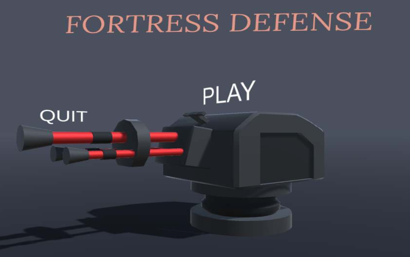

Main Menu of the Game

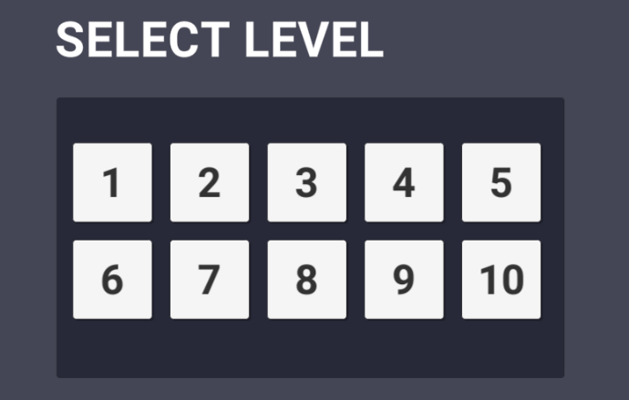

Level Selection of the Game

Level 1

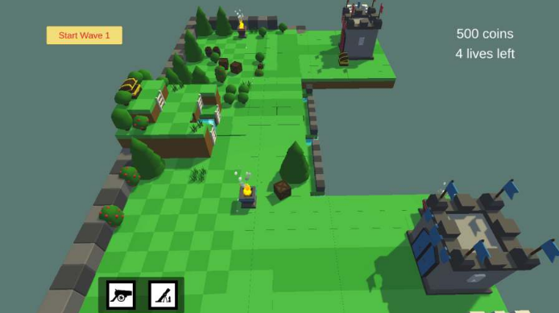

Level 2

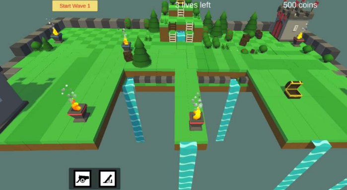

Level 3

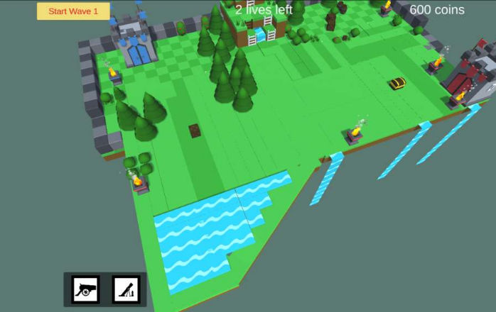

Level 4

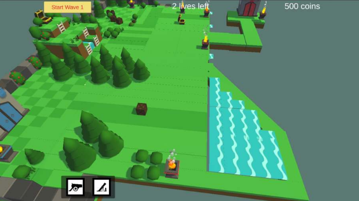

Level 5

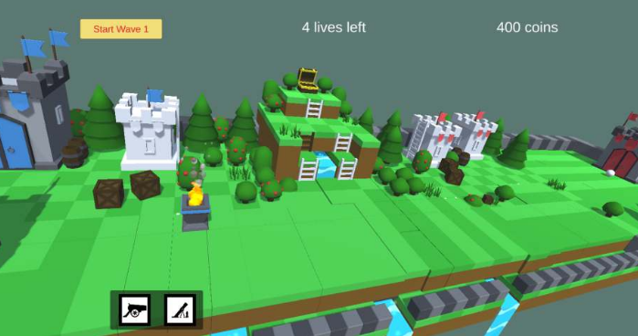

Level 6

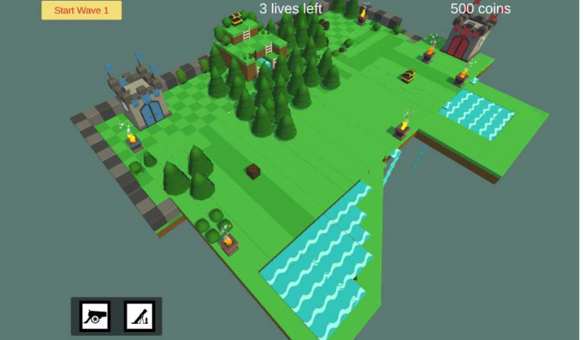

Level 7

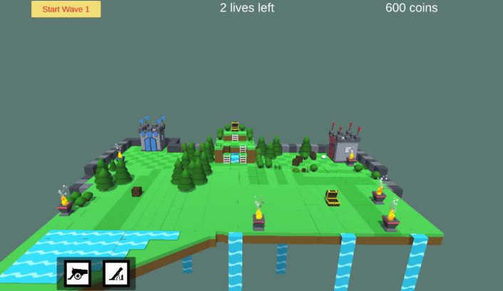

Level 8

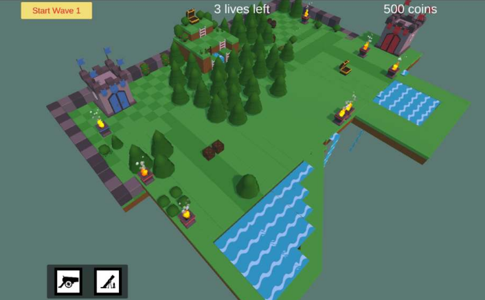

Level 9

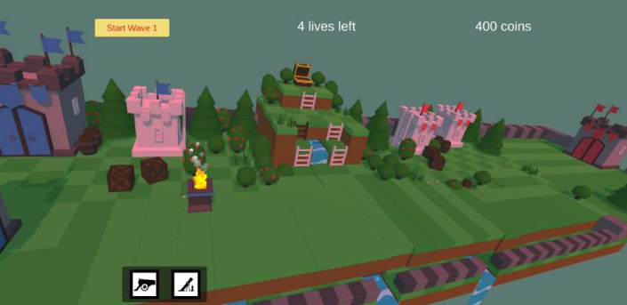

Level 10

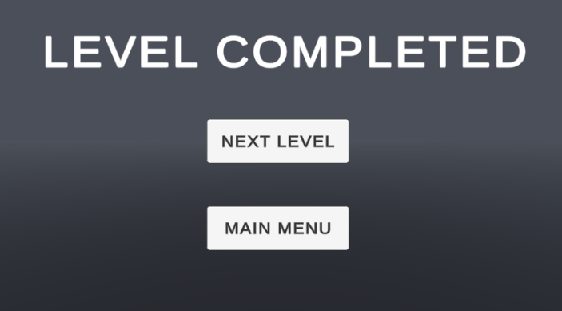

Level Completed

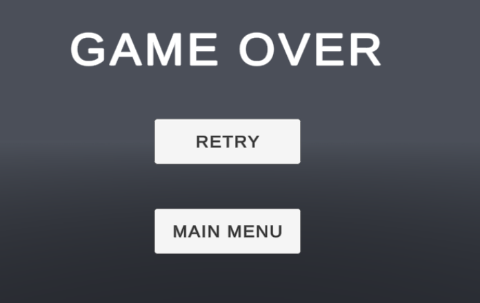

Game Over

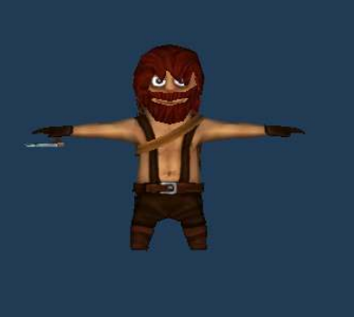

Lumberjack 1

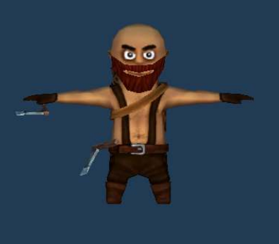

Lumberjack 2

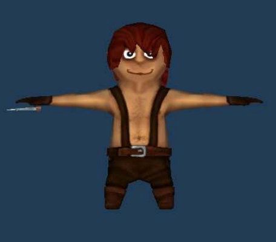

Lumberjack 3

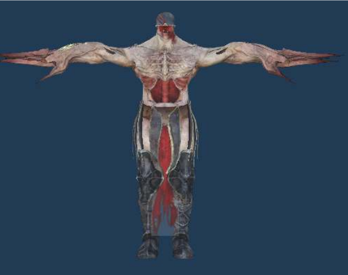

Skeleton

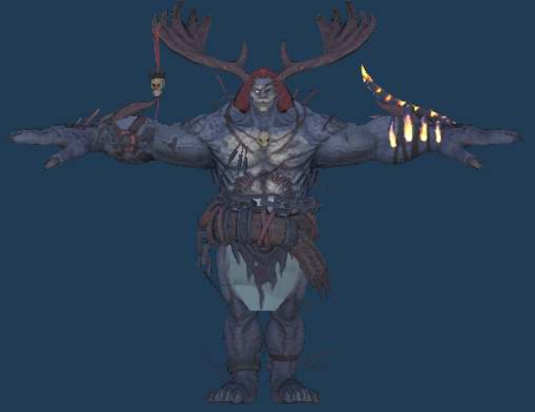

Dahaka

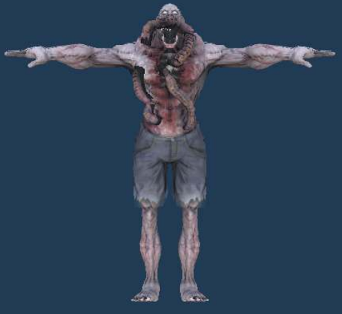

Parasite

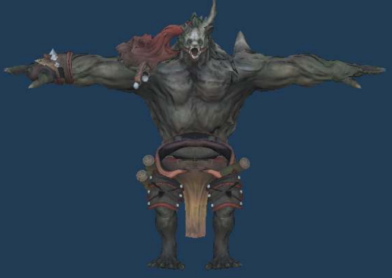

Warrok

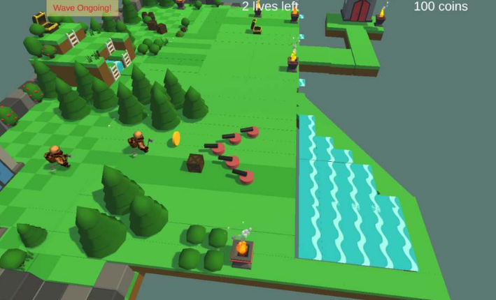

Playing One of the Levels of the Game

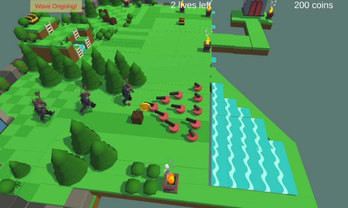

Playing the Second Wave of the Game

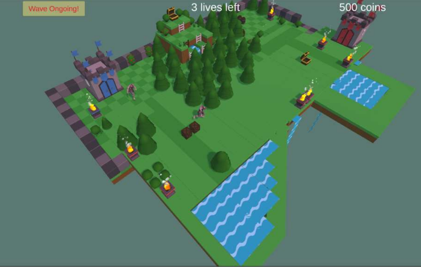

Playing Another Level of the Game

## Conclusion

In our game “Tower defense”, we have implemented the concept of 2 towers, one belonging to the enemy(from which they spawn) and the other is the fortress that we have to protect. The user is offered a variety of weapons in his arsenal to place along the path taken by the intruders. The cannon locks onto a particular enemy and shoots till either the enemy is dead or the enemy moves out of its range. The mortar, on the other hand, delivers splash damage to enemies within its range. At each level of the game, the player is given a certain no. of lives and coins to erect his defenses. As the level increases, the difficulty increases progressively, in the sense that the enemy waves increase along with the no.of enemies in the wave. The enemies too differ in their respective health points. A total of 7 types of enemies have been included in this game.

We learnt a lot through this project. This project has sharpened our concept of Game engine, animation and the game graphical user interface. We learnt a lot about the kinds of evasion games. The piece of software we developed is intended to serve the gamers of the world. The success of this project may give gaming pleasure to the players. This project not only tested our technical skills but also our temperament.

